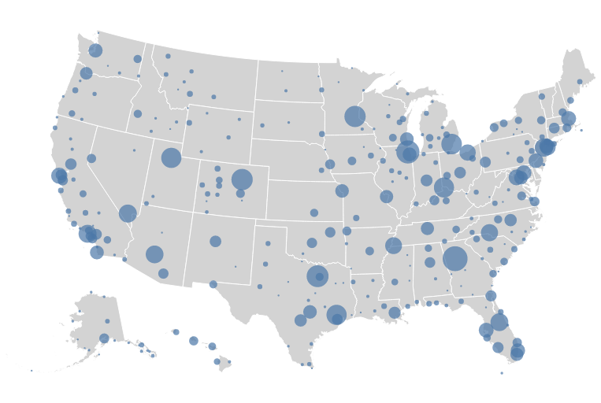

# Syntax

## Bread and butter

Bibtex references: `[@del2020supply]` produces [@del2020supply] given the bibtex entry [@lst:bib]


```
@article{del2020supply,

  title={Supply and demand shocks in the COVID-19 pandemic: An industry and occupation perspective},
  author={del Rio-Chanona, R Maria and Mealy, Penny and Pichler, Anton and Lafond, Francois and Farmer, J Doyne},
  journal={Oxford Review of Economic Policy},
  volume={36},
  number={Supplement\_1},
  pages={S94--S137},
  year={2020},
  publisher={Oxford University Press UK}
}
```
: Bibtex entry {#lst:bib}

Inline math equations:  `$E=mc^2$` produces $E=mc^2$.

Block math equations: `$$E=mc^2$${#eq:energy}` produces $$E=mc^2$${#eq:energy}

Refer to equations: `[@eq:energy]` produces "[@eq:energy]"

Figures: `{#fig:example1}` produces [@fig:label1]. Note that in order to generate a proper figure (i.e. something referenceable and with a caption) rather than a normal markdown image, there needs to be a new paragraph (e.g. two new-lines) before the image syntax.


{#fig:label1}

Refer to a figure: `[@fig:example]` produces [@fig:label1]

Tables:

```
| centre justified column | right justified column |
| :-------------------: | ---------------------: |
| row 1                 | row 1                  |
| row 2                 | row 2                  |
: Your caption {#tbl:table}
```

produces

| left justified column | right justified column |
| --------------------- | ---------------------: |
| row 1                 | row 1                  |
| row 2                 | row 2                  |
: Your caption {#tbl:table}

Refer to a table: `[@tbl:table]` produces "[@tbl:table]"

Section referencing happens similarly.

**NOTE:** `tbl:`, `fig:`, `eq:` are required label prefixes, not something I've chosen.

## Interactive Altair figures

[Pandoc filters](https://pandoc.org/filters.html) provide a way for users to write programs (filters) which manipulate Pandoc's abstract syntax tree (AST)[^ast] representation.

[^ast]: The abstract syntactic structure of the document. Nodes in the tree are things like `Header`, `CodeBlock`, `BulletList`, etc.

We've written a filter to take the following syntax,

```<div class=altair s3_path="altair_example1.json" static_path="altair_example1.png" id="fig:figure_label">
Your figure caption here
</div>
```

and embed an interactive [vegalite/altair](https://altair-viz.github.io/index.html) figure based on the JSON spec given by `s3_path`  if the output format is HTML. Otherwise, the static image given by `static_path` will be rendered.

For example, the above syntax produces [@fig:figure_label] (it may be static or interactive depending on whether you are reading this in HTML, PDF or something else).

<div class=altair s3_path="altair_example1.json" static_path="altair_example1.png" id="fig:figure_label">
Your figure caption here
</div>

<div class=altair s3_path="altair_example2.json" static_path="altair_example2.png" id="fig:figure_label2">
Here's another example plot.
</div>

### Parameters

* `s3_path` an S3 key in the bucket that was set in the command to pandoc (`--metadata bucket="<bucket-name>"`). Should contain the JSON spec for a vegalite visualisation.
* `static_path` a path to a static image that can be displayed in LaTeX, e.g. png.
* `width`, `height` - Altair doesn't seem to be able to do `%`.

### Making it more concise

The `div`-based syntax is a bit unwieldy.
Looking into introducing additional more concise (but less flexible) syntax, something like:

`{fig:figure_label #altair}`

When outputting to HTML this would look for `altair_example2.json` in a bucket passed in by the build command and substitute in the altair interactive figure instead.

## Metadata

Metadata goes at the **very** top. Declares things like the document title, any output format dependent styling such as HTML headers or latex graphics paths.
```
---
title: "Technical report example"
figPrefix:
  - "figure"
  - "figures"
tblPrefix:
  - "table"
  - "tables"
secPrefix:
  - "section"
  - "sections"
codeBlockCaptions: true
---
```

## Outputting a document

Produce a HTML report with:

```shell
pandoc -s report.md\
 -f markdown\
 -o report.html\
 -F pandoc-crossref\
 --bibliography 'technicalreport.bib'\
 --filter ../bin/altair_pandoc_filter.py\
 --metadata bucket="nesta-test"\
 -C
```

Produce a tex file with:

```shell
pandoc -s report.md\
 -f markdown\
 -o report.tex\
 --bibliography 'technicalreport.bib'\
 --filter ../bin/pandoc_altair_filter.py\
 --natbib -F pandoc-crossref\
 --metadata figure_path="figures"\
 --variable urlcolor=blue
```
